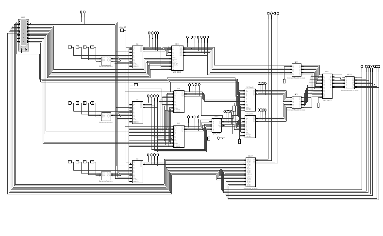

# ALU Scheme

**The Arithmetic Logic Unit it's a fundamental digital circuit component within a computer's central processing unit (CPU) or a similar processing unit. The ALU performs arithmetic and logic operations on input data. It's a crucial part of a processor because it's responsible for carrying out the actual computations and logical comparisons that form the basis of a computer's operations**

# The Multisim scheme

# The microoperation map
